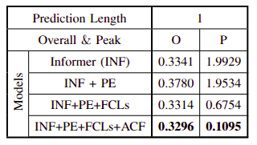

# Burst Aware Forecasting of User Traffic Demand in LEO Satellite Networks

This is the repo for the ``Burst Aware Forecasting of User Traffic Demand in LEO Satellite Networks" paper.

## Required packages
Python 3.7.17 is used alongside the libraries provided in requirements.txt

## Changes over standard Informer architecture

Three main changes can be seen under 
1) models/embed.py and data/data_loader.py for Peak embedding
2) models/model.py for the additional Fully Connected Layers
3) exp/exp_informer.py for the asymmetric training loss

The rest of the codebase is in parallel with standard informer architecture

## Dataset

Used dataset is provided under data/ETT as the 1.04_750_10ms.csv and bursts177.csv
get_bursts.py is used to find the burst locations

## Results

## Acknowledgement
Most of the codebase is derived from the following main repo:

https://github.com/zhouhaoyi/Informer2020